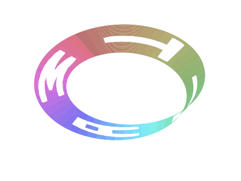

# mobiusmatt

The word MATT cut out of a Möbius strip, rendered in matplotlib.



On the web: [mattabate.com/projects](https://mattabate.com/projects) (Möbius Matt).

## Install

Python 3.10 or newer. Pulls in numpy and matplotlib.

```
pip install git+https://github.com/mattabate/mobiusmatt
```

## Usage

Four commands. Each one opens a matplotlib window, or with `--out` writes a
file headless instead. Run `mobiusmatt <command> --help` for every flag.

| command | what you get |
|---|---|
| `mobiusmatt strip` | MATT on the strip; without `--out`, the camera circles and rocks until you close the window (made for screen recording) |
| `mobiusmatt torus` | MATT tiled around a torus |
| `mobiusmatt layout` | 2D check: the unrolled strip, letters in place, coloured dots marking which ends get glued (red to red, blue to blue) |
| `mobiusmatt letter M` | preview one letter |

`--word` accepts any word spelled from the letters M, A and T.

A still of the strip:

```
$ mobiusmatt strip --out mobius_matt.png
MATT: 4 letters, 19958 of 80000 grid points cut out
wrote mobius_matt.png (66602 bytes)
```

MATTMATT, letters half as wide:

```
$ mobiusmatt strip --word MATT --times 2 --out mattmatt.png
MATTMATT: 8 letters, 19972 of 80000 grid points cut out
wrote mattmatt.png (68383 bytes)
```

The GIF above, byte for byte: the same strip, one turn of the camera with two
rocks of elevation, 120 frames at 12 fps.

```
$ mobiusmatt strip --out mobius_matt.gif
MATT: 4 letters, 19958 of 80000 grid points cut out
wrote mobius_matt.gif (120 frames, 480 px, 12 fps, 1641621 bytes)
```

The torus, the word twice per row:

```
$ mobiusmatt torus --num-x 2 --num-y 1 --out torus.png
MATT on a torus: 32 letters
wrote torus.png (104667 bytes)
```

Where each letter sits along the unrolled strip (`u` runs 0 to 2π around the loop):

```
$ mobiusmatt layout --times 2 --out layout.png
T  u = 0.403
T  u = 1.188
A  u = 1.973
M  u = 2.759
T  u = 3.544
T  u = 4.330
A  u = 5.115
M  u = 5.900
wrote layout.png (17520 bytes)
```

```
$ mobiusmatt letter A --out letter_a.png
A: 11 border points, 10 hole points
wrote letter_a.png (22941 bytes)
```

A letter outside the font is refused:

```
$ mobiusmatt strip --word BAT
usage: mobiusmatt strip [-h] [--word WORD] [--times TIMES] [--out OUT]
                        [--frames FRAMES] [--width WIDTH] [--fps FPS]
mobiusmatt strip: error: argument --word: the font only has the letters M, A, T; 'BAT' uses B
```

`python -m mobiusmatt` works the same way. From Python:

```python
from mobiusmatt import cut_strip

u, (x, y, z) = cut_strip("MATT")  # NaN wherever a letter was cut out
```

## How it works

`mobiusmatt strip` parameterises a Möbius strip on a fine grid, lays the letters of the
word end to end along its length, and punches each letter out of the surface:
every grid point that falls inside a letter's outline becomes NaN, so the strip
is drawn with letter-shaped holes. The surface is coloured by position around
the loop (the HSV colormap, so the colour cycles once per trip), and the camera
then rocks up and down while circling the strip, which is what you screen-record.

The letters cut all the way through, so they read from both faces of the strip
(mirrored from the back).

`mobiusmatt torus` is the same trick turned inside out on a torus: the word is tiled in
both directions around the tube, each row shifted one letter along, and this
time everything *outside* the letters is removed, so the torus is made of
letters.

`mobiusmatt/font.py` is the font: hand-drawn polygon outlines for M, A and T (A has a
hole), with `shift`, `rotate` and `stretch` so a letter can be placed anywhere
on the parameter grid. Only those three letters exist, which is enough for MATT.

The details, in `mobiusmatt/core.py`:

- **The strip.** `u` runs around the loop in [0, 2π] and `v` across it in
  [-0.5, 0.5], on an 800 × 100 grid:
  `x = (1 + v/2·cos(u/2))·cos u`, `y = (1 + v/2·cos(u/2))·sin u`, `z = v/5·sin(u/2)`.
  The `u/2` is the half twist: the point (2π, v) is the point (0, −v).
- **Placing letters.** A word of n letters gives each letter 2π/n of the loop.
  Each outline is stretched to that width, turned a quarter turn so it runs
  along the strip, and placed right to left in `u`, so it reads left to right
  from outside.
- **Cutting.** matplotlib's `Path.contains_points` tests every grid point
  against the letter's outline (and against the hole in A, which stays).
  Points inside become NaN in x, y and z, and `plot_surface` leaves NaN cells
  undrawn.
- **The torus.** A torus with R = 2, r = 1.2 on an 800 × 200 grid. Every letter
  is its own surface with NaN *outside* the letter.
- **The loop.** For the GIF, azimuth turns 360° over the frames while elevation
  sweeps from −40° to 75° and back twice, so the last frame meets the first.

`mobiusmatt/render.py` draws those arrays; `mobiusmatt/cli.py` is the command line.

## Development

```
git clone https://github.com/mattabate/mobiusmatt
cd mobiusmatt
pip install -e ".[test]"
pytest -q
```

```
.........................                                                [100%]
25 passed in 4.48s
```

The tests pin the number of grid points cut for several words against the
original 2024 scripts (the package reproduces their arrays exactly), check the
half twist and the font, and run each command headless.

## History

From April 2024 until September 2026 this lived at
`github.com/mattabate/wordplay/tree/main/mobiusmatt`. The commit history
stays in [wordplay](https://github.com/mattabate/wordplay).

## License

MIT.
